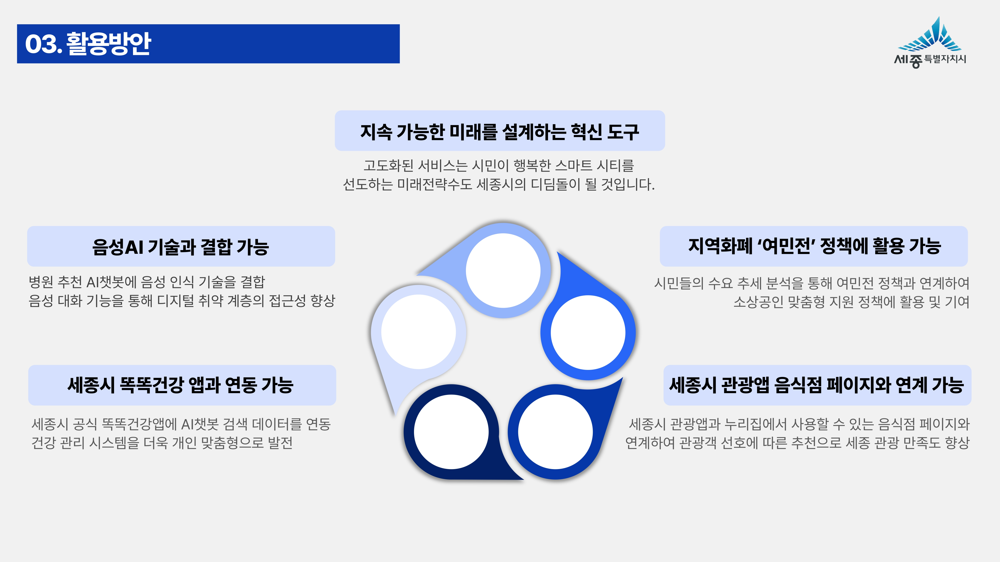

# Custom-Recommender
### Service Development Project
  **/ Crawling / Streamlit /**

---

## [데이터와 AI를 활용한 병원·음식점 맞춤형 추천 서비스]
- **목적**

  - 시민 편의를 위한 기존 서비스와 차별화된 맞춤형 추천 서비스 개발

- **주요 특징**

  - 부위·통증에 따른 맞춤 병원 추천
  - 필요 정보를 간편하게 확인 가능
  - 다양한 선호에 따른 맞춤형 필터링
  - 사용자 편의에 맞는 여러 정보 출력
  - 기존 어플에 기능 추가 용이
 
- **사용 기술**

  - Python  /  Crawling  /  Streamlit

- **강화 역량**

  - 카카오맵의 상세 정보 크롤링
  - 위도·경도 등 위치 데이터 전처리 
  - 동적 가중치를 적용한 필터링 기능
  - 규칙 기반 챗봇 개발 및 구현 
  - Streamlit을 활용한 서비스 홈페이지 개발

---

## 🎥 프로젝트 시연 영상

  

  
  

--- 

## 📄 프로젝트 문서

  <h6>※ PDF로 보시는 것을 추천드립니다 
   (하단 이미지의 품질에 한계가 있습니다)</h6>

 

  
  
  

 
  

   
   
   
   
   
   
   
   
   
   
   
   
   
   
   
   
   
   
   
   
   
   
   
   
   
   
   
   
  

---

## 📬 문의
 
